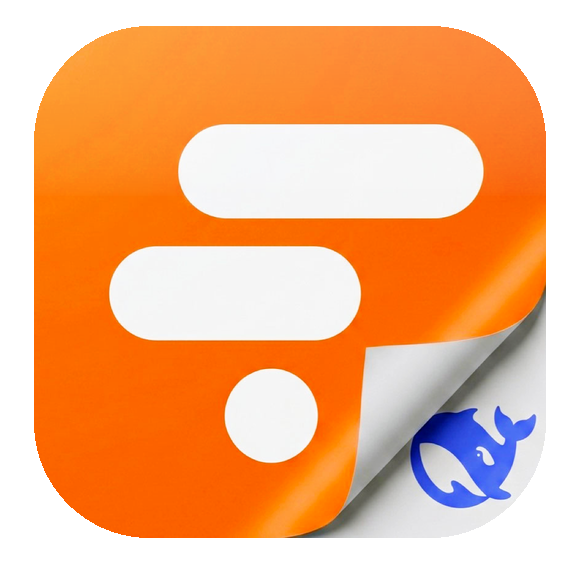
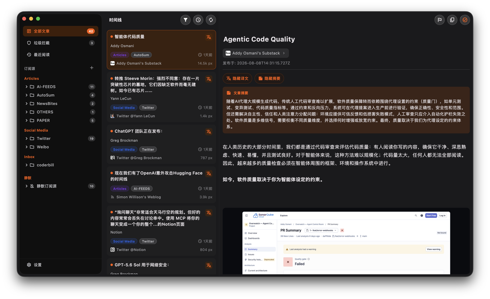
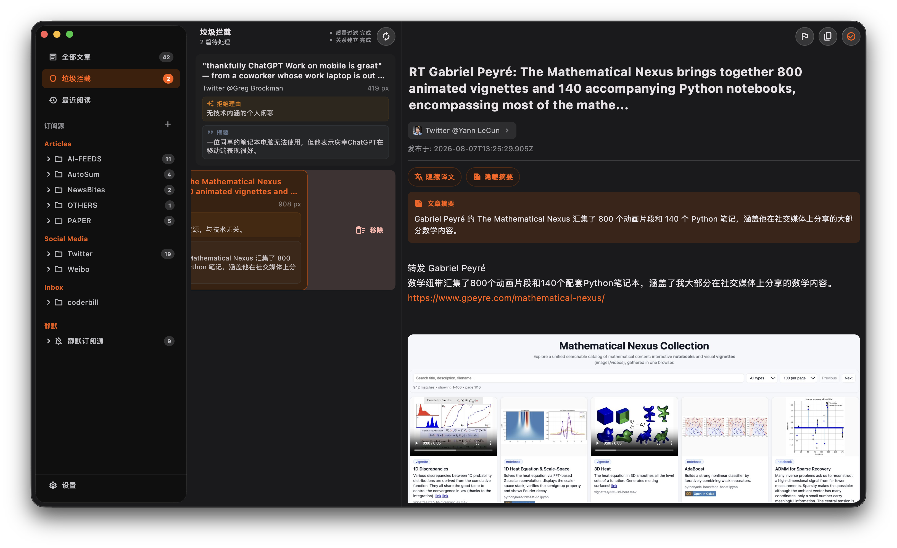

# Auto Folo — Folo RSS 阅读器

<p align="center">
  
</p>

基于 Flutter 的 Folo RSS 聚合阅读客户端，支持 Android 和 macOS。聚焦高密度信息流阅读：同步 Folo 文章、按源筛选、逐块渲染长文，并用 DeepSeek 完成可配置的翻译、摘要与垃圾拦截判定。

> Auto Folo 是个人用途的非官方二次开发客户端，不隶属于 Folo、RSSNext 或其运营方，也不代表官方发布版本。

## 主要功能

<p align="center">


</p>

- **时间线** — 未读 / 全部筛选、最近阅读、长度排序与 macOS 分栏阅读
- **订阅源** — Articles / Social Media / Inbox 分组，分类与订阅源筛选、搜索、静默订阅源
- **文章阅读** — HTML 拆块渲染、目录跳转、Markdown 复制、图片画廊与视频播放
- **垃圾拦截** — DeepSeek 判定后进入独立审核页，可保留或移除，不直接替用户做最终决定
- **已读同步** — 本地 + Folo 云端双向同步
- **AI 翻译 / 摘要** — 独立 LLM 配置与后台队列；自动任务只服务仍未读的文章
- **配置迁移** — 设置可导出为 JSON 并通过剪贴板导入
- **桌面体验** — macOS 原生分栏、克制的 Liquid Glass、右键菜单、快捷键与同步状态反馈

## 快速开始

```bash
flutter pub get
flutter run -d macos       # macOS
flutter run -d <device-id> # Android
```

构建桌面版：

```bash
flutter build macos --release
```

## 首次配置

1. 打开应用 → 设置页
2. 填写 **Folo Session Token**，从 Folo Web 应用的 Cookie 中获取
3. 填写 **DeepSeek API Key**（翻译、摘要和垃圾拦截功能需要）

## 开发

```bash
dart analyze lib test
flutter test --no-pub
```

## 文档

- 工程 Wiki（中文，克隆后双击 `index.html` 即可离线浏览）：[入口](index.html)
- 交接入口：[`AGENT_HANDOFF.md`](AGENT_HANDOFF.md)
- 知识库维护说明：[`docs/agent_handoff/meta/site-guide.html`](docs/agent_handoff/meta/site-guide.html)

## 许可证

Auto Folo 按照 [`AGPL-3.0-only`](LICENSE) 授权。第三方版权与许可证见
[`THIRD_PARTY_NOTICES.md`](THIRD_PARTY_NOTICES.md)。
